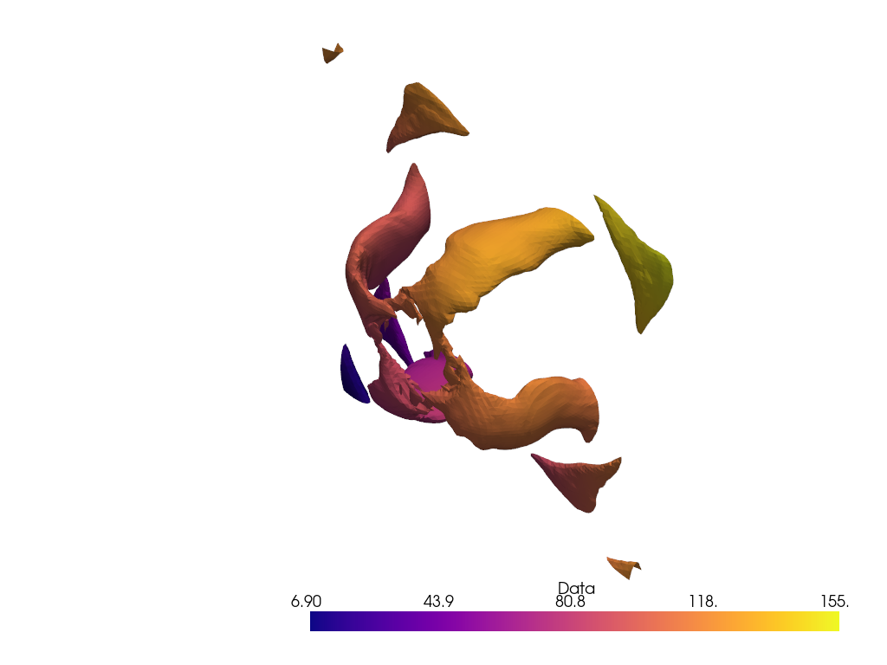

A few scripts which take output from OpenFOAM in the form of 3D velocity/vorticity
fields and evaluate the 2D Lagrangian vortex boundaries over a chosen time series.
This can be run on a decent enough laptop GPU but it is recommended to use a datacentre
(Nvidia A100/V100).

Running cylinder_transform_velocity/vorticity will collect the data from a text
file, scale, and convert to a single precision array, which is then serialised
for later use.

The vortex boundaries are isocontours of the LAVD (Lagrange-averaged vorticity 
deviation) field. The trajectories are calculated via a fourth order Runge-Kutta
scheme and the vorticity deviation is evaluated along the trajectory. Additional
values of the vorticity field are obtained using Hermite interpolation for the 
trajectories and Lagrange interpolation for the vorticity field.

Mostly this is written in the structured paradigm, with some reliance on the
imperative.

Input parameters can be explained as follows: 
  -d, Time difference between successive snapshots. 
  -i, Initial time to seed integrations. 
  -f, Final time to seed integrations. 
  -w, Integration window. 
  -x, Spatial interpolation (not implemented). 
  -t, Number of subgrid points to be interpolated.

For example, LAVD_63_83 plots the accumulated vorticity starting from a 
uniform grid at frame 63, integrating forward 20 frames.

